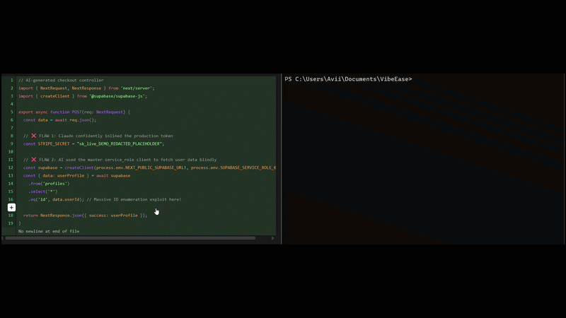

<div align="center">

# ✈️ PreFlight



**Stop AI Coding Drift. The local terminal guardrail that catches Cursor and Claude hallucinations before they leak your database.**

[](LICENSE)
[](https://www.npmjs.com/package/preflight-cli)

</div>

## The Problem

AI coding agents move at 100mph. Cursor, Claude, and other agentic coding tools can scaffold features in seconds, but they also silently introduce structural flaws that are easy to miss in review:

- Row-Level Security gets stripped out or bypassed.
- Frontend bundles receive hardcoded secrets.
- Webhooks, auth checks, and tenant boundaries are left half-wired.
- RPC wrappers and helper abstractions drift away from the security model you thought you had.

PreFlight is the Shift-Left guardrail for that drift. It intercepts `git commit`, scans the staged diff locally, and blocks unsafe code before it lands in your repository.

## Core Engine: The Tri-State Approach

PreFlight does not pretend every issue is equally knowable from a local diff. The engine classifies every scan into one of three states:

### 🔴 Confirmed Finding

PreFlight hard blocks the commit on definitive issues such as exposed Stripe keys, hardcoded credentials, or raw SQL injection patterns.

The free local engine can automatically redact confirmed secrets before they ever leave your machine.

### 🟢 Likely Safe

When the staged diff is clean, PreFlight passes the commit normally and prints a transparent receipt:

```text
🟢 Safe: Local syntax and basic guards verified.
```

### 🟡 Fuzzy Context Detected

When the local AST engine hits a complex multi-file boundary such as an RPC wrapper, tenant helper, `supabase.auth` flow, or `createContext` abstraction it cannot fully resolve, PreFlight pauses the commit and prompts the developer to run:

```bash
preflight upgrade
```

That handoff unlocks the Cloud AI Engine for contextual patching and deep security tracing.

## Quick Start (Free Local Engine)

Install the CLI globally:

```bash
npm install -g preflight-cli
```

Initialize PreFlight inside your repository:

```bash
preflight init
```

This installs the safe `.git/hooks/pre-commit` script.

Commit as usual:

```bash
git commit -m "feat: login route"
```

PreFlight instantly steps in, scans the staged diff, and blocks the commit if it detects AI Coding Drift.

## PreFlight Pro & Teams (Hybrid Architecture)

PreFlight uses a Hybrid Router.

First, it checks your hardware. If your machine has enough CPU, RAM, and VRAM, PreFlight runs advanced local analysis natively. If not, only complex architectural scans are safely routed to the Cloud AI Engine for deeper reasoning.

Your fast local guard stays free. The cloud path is reserved for the cases a regex or local AST pass cannot honestly prove.

| Feature | Community (Free) | Pro ($19/mo) | Teams ($49/seat/mo) |
| :--- | :--- | :--- | :--- |
| Local AST Secret & Syntax Scans | ✅ | ✅ | ✅ |
| Basic Auto-Fixes (Secrets/Redaction) | ✅ | ✅ | ✅ |
| Cloud AI Logic Interception | ❌ | ✅ | ✅ |
| Deep Architectural Auto-Patching | ❌ | ✅ | ✅ |
| Plain-English QA Prompts | ❌ | ✅ | ✅ |

## Closed Beta

🚀 **PreFlight Pro is currently in Closed Beta.**

Run `preflight upgrade` in your terminal or [click here to join the waitlist](https://waitlister.me/p/preflight) to secure early access to the Cloud AI Engine.
